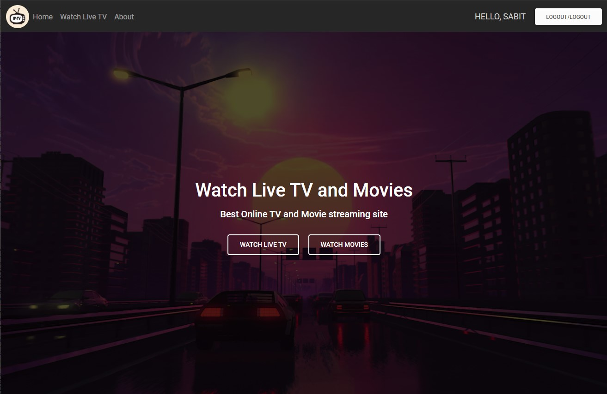
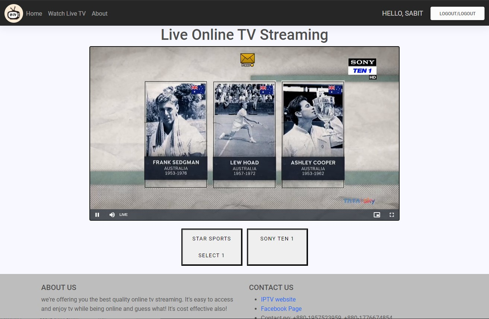

&nbsp;

&nbsp;

<strong></strong>

<strong>North South University</strong>

Department of Electrical &amp; Computer Engineering

<strong>Project Report</strong>

<strong>Group No</strong>: 15

<strong>Fall 2020</strong>

<strong>Project Name</strong>: Online IPTV Solution

<strong>Course No</strong>: CSE 299 <strong>Sec</strong><strong>:</strong> 2

<strong>Faculty</strong>: Shaikh Shawon Arefin Shimon (Sas3)

<strong><u>Member 1</u></strong><u>:</u>

<strong>Name</strong><strong>:</strong> G. M. Sabit Zubair

<strong>ID</strong><strong>:&nbsp; </strong>1520547642

<strong>Email</strong><strong>:</strong> <a href="sabit.zubair@northsouth.edu">sabit.zubair@northsouth.edu</a>

<strong><u>Member 2</u></strong><strong><u>:</u></strong>

<strong>Name</strong><strong>:</strong> S.F. Nabobi Khan

<strong>ID</strong><strong>:&nbsp; </strong>1431174042

<strong>Email</strong><strong>:</strong> <a href="nabobi.khan@northsouth.ed">nabobi.khan@northsouth.edu</a>

<strong>Git Repository</strong><strong>: </strong><a href="https://github.com/NSU-FA20-CSE299-2/Group15/">https://github.com/NSU-FA20-CSE299-2/Group15/</a>

<strong>Date Prepared</strong><strong>: </strong>1/21/2021

<strong>&nbsp;</strong>

<strong>&nbsp;</strong>

# Project Report

## Abstract
We started our project, IPTV server with a purpose of offering better and easy to access tv streaming site, where we all can watch tv and enjoy ourselves! Through out the semester, we faced some difficulties completing the project.

## Progress

|Features|Working features|Under-developed features|
|-|-|-|
|Signup/Register|It's working via email address.| Login with phone number.|
|High Quality Video Streaming | Supports upto 4k |..| 
|Computer and smartphone support| It supports any device with js support. it's responsive.|.. |
|Smart TV for streaming IPTV|JScript supported players can stream.|M3U playlist for smart tv.|
|Payment gateway|..|Online payment.|
|Customizable profile|..|Need more time.|
|2 step verification|..|Need more time.|
|Channels|Channels load from database|..|
||Channel list can be updated through database by admins|..|
||..|Channel search by name,genre etc|
||..|Favourite channel list|
||..|Channel auto suggestion|
|Admin panel|Functions properly.|..|
|Dockerization| It's now running on python package manager|Once project finishes it'll be dockerized.|

## Frontend
We used..
- HTML
- CSS
- JavaScript

For framework we used..
- [Bootstrap](https://getbootstrap.com/) 5.0
- [Material design](https://mdbootstrap.com/) 2.0

## Backend
We used..
- [NGINX server](https://www.nginx.com/) - for video content delivery
- [RTMP Nginx module](https://hub.docker.com/r/alfg/nginx-rtmp/) - for ingesting rtmp video and convert it to HLS stream
- [Django](https://www.djangoproject.com/) 3.1 - for backend
- [django-countries](https://pypi.org/project/django-countries/)  7.0 - for adding all countries in the database

## Database
As we are operating this project on small scale, so we used SQLite. When we will be operating it on bigger scale we will switch to MariaDB/MongoDB or firebase.

## Additional technologies
We didn't use Allauth. We used Django Contrib Authentication module for Login and Logout.
For regsitration we used Django contrib auth forms.
Also we used Django contrib auth decorator for login requirement or restricting access to all anonymous users

## User Interface
### Landing Page
When users visil our site, the landing page or home page will be this:

   
  Landing Page

### Live TV Streaming
In this section users will be able to watch the streams that we provide. And this streams will be added in the database by the admins of the service.

   
  Landing Page

